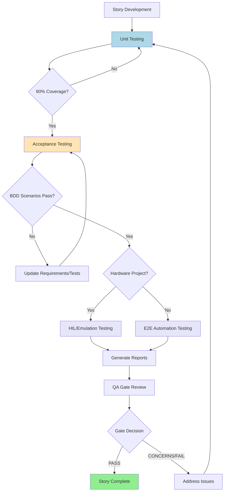

<!-- DO NOT EDIT: This file is auto-synced from docs/standards/sw-testing-standard.md. Edit the SoT instead. -->
# Software Testing Official Organization-Wide Standards of Procedures
> **Note:** This document is the authoritative testing framework for all Axovia Flow Projects

## Purpose

This document defines the company's software testing standards, ensuring consistent quality and structured practices across all projects. It applies to both hardware-inclusive and software-only projects and serves as the **primary testing authority** for all BMad-Core workflows.

---

## Testing Strategy

### Three-Stage Testing Approach

1. **Unit Testing**
> **Note:** Mocks are reserved for unit testing only, unless absolutely necessary and explicitly approved by the repository owner.

   * **Preferred Language**: Python (pytest) or Typescript (Jest, Mocha, etc.)
   * **Preferred Framework**: pytest or Jest
   * **Preferred Location**: `tests/unit`
     - **Note:** If there is a problem with the locations, language, or frameworks, please open an issue in the repository to raise the concern. DO NOT implement any other unit testing framework or language without approval.
     
   * **Coverage Requirement:** Minimum **90% coverage**.
   * **Focus:** Validate individual functions, modules, and components in isolation.
   * **Method:** Automated unit test frameworks with mocking/stubbing where necessary.
   * **Integration:** Use `test-levels-framework.md` for detailed decision criteria and examples.

2. **Acceptance Testing**

   * **Focus:** Validate that the system meets **business requirements**.
   * **Method:** Behavior-Driven Development (BDD) style tests (e.g., Gherkin).
   * **Mapping:** All acceptance scenarios must map directly to PRD requirements.
   * **Traceability:** Use `trace-requirements` task for automated mapping.

3. **Integration Testing**

   * **Focus:** Validate **system workflows** and interactions beyond unit scope.
   * **Project-Specific Methodology:**

     * **Hardware Projects** → Integration and Acceptance tests run as:

       * **HIL Testing** if hardware is present.
       * **Emulation Testing** if hardware is unavailable (pipeline or remote execution).
     * **Software-Only Projects** → Integration and Acceptance tests run as:

       * **E2E Automation Tests** wherever feasible, covering full workflows.

---

## Test Case Guidelines

* **Behavior Scenarios:** Each test scenario must map clearly to PRD requirements.
* **Edge Cases:** Must be included, covering hardware limits (where applicable), production issues, and stress/failure boundaries.
* **Automation:** Automate tests whenever possible; manual testing only if automation is impractical.
* **Risk-Based Prioritization:** Use `test-priorities-matrix.md` for P0/P1/P2/P3 classification.

---

## Execution & Reporting

1. **Test Plans:**
   Each project must include a structured test plan before implementation begins.
   * Use `test-design` task for automated test scenario generation.
   * Reference `test-levels-framework.md` for implementation guidance.

2. **Coverage Reporting:**
   Unit test coverage must be tracked and reported; Integration/Acceptance test pass rates must also be documented.

3. **Sign-Off Criteria:**

   * **Unit:** ≥90% coverage achieved.
   * **Acceptance:** All BDD scenarios pass and align with PRD.
   * **Integration:**

     * Hardware projects → HIL or Emulation testing completed and passed.
     * Software-only projects → E2E automation testing completed and passed.

4. **Reports:**
   Each release must include two standardized outputs:

   * `functionality-report.json` → Technical test results, coverage metrics, and PRD mapping.
   * `executive-report.json` → High-level summary of success rates, risks, and open issues for stakeholders.

5. **Defect Management:**

   * All failures logged in defect tracking system.
   * Root cause analysis required for repeat issues.
   * Use `risk-profile` task for systematic risk assessment.

---

## BMad-Core Integration

### Agent Workflow Integration

* **QA Agent**: Primary implementer of this standard through `*test-design`, `*trace`, and `*gate` commands
* **Dev Agent**: Must achieve 90% unit coverage before story completion
* **PM Agent**: Ensures acceptance criteria are BDD-testable during story creation

### Task Integration

* **test-design.md**: Automated test scenario generation following this standard
* **trace-requirements.md**: Maps acceptance tests to PRD requirements
* **qa-gate.md**: Validates compliance with this standard before story approval
* **review-story.md**: Comprehensive review including testing standard compliance

### Quality Gates

All stories must pass through QA gates that validate:\

* [ ] Unit tests achieve ≥90% coverage
* [ ] Acceptance tests map to PRD requirements using BDD format
* [ ] Integration tests cover all external system interactions
* [ ] Test reports generated in standardized format

---

## Supplementary Resources

### Implementation Guidance

* **test-levels-framework.md**: Detailed decision criteria for test level selection
* **test-priorities-matrix.md**: Risk-based prioritization (P0/P1/P2/P3) system

### Automated Tooling

* **test-design task**: Systematic test scenario generation
* **trace-requirements task**: Automated requirement-to-test mapping
* **qa-gate task**: Quality gate decision automation

---

## Continuous Improvement

* Quarterly review of testing practices.
* Adoption of new automation/emulation tools as appropriate.
* Maintain alignment with industry standards (ISTQB, IEEE 829, ISO/IEC/IEEE 29119).
* Regular updates to supplementary guidance based on project learnings.

---

## Flow Diagram

---

✅ **This three-stage standard (Unit → Acceptance → Integration) is the authoritative testing framework for all BMad-Core projects.**

<!-- CONDITIONAL TEST MARKER -->
